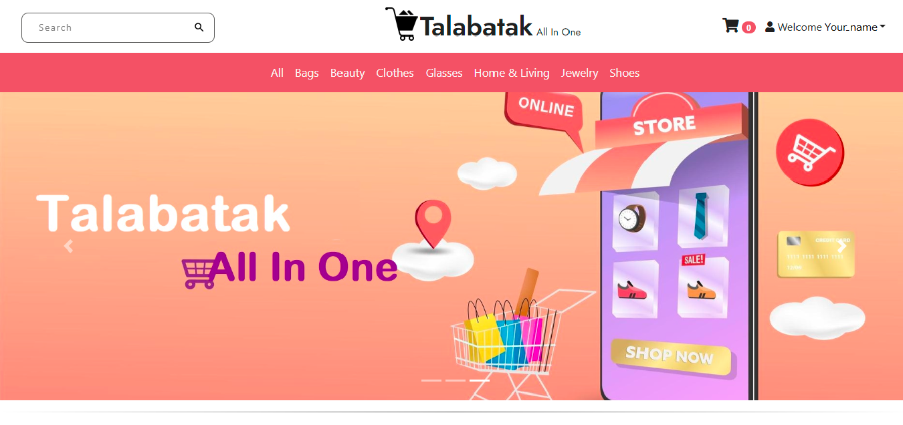

# Talabatak

## Table of contents

- [Introduction](#introduction)
- [Demo](#demo)
- [Technology](#technology)
- [Features](#features)
- [Database Models](#database)

## Introduction

A e-commerce website using Node js, Express js, and MongooseDB.

## Demo

The website resembles a real store and you can add products to your cart and pay for them. If you want to try the checkout process, you can use the dummy card number provided by stripe for testing which is 4242 4242 4242 4242 with any expiration date, CVC, and zip codes. Please <u><b>DO NOT</b></u> provide real card number and data.

In order to access the admin panel on <b>admin</b> you need to provide the admin email and password.

## Features

The Website displays a virtual products store that contains virtual products and contact information.
Users can do the following:

- Create an account, login or logout
- Browse available products added by the admin
- The profile contains all the orders a user has made
- To logout, a user must be logged in
- Add products to the shopping cart
- Delete products from the shopping cart
- Display the shopping cart

Admins can do the following:

- Login or logout to the admin panel
- View all the information stored in the database. They can view/add/edit/delete orders, users, products and categories. The cart model cannot be modified by an admin because a cart is either modified by the logged in user before the purchase or deleted after the purchase.

## Database

All the models can be found in the model directory created using mongoose.

### User Schema:

- username (String)
- email (String)
- password (String)

### Category Schema:

- title (String)
- slug (String)

### Product Schema:

- productCode (String)
- title (String)
- imagePath (String)
- description (String)
- price (Number)
- category (ObjectId - a reference to the category schema)
- manufacturer (String)
- available (Boolean)
- createdAt (Date)

### Cart Schema:

- totalQty (Number)
- totalCost (Number)
- createdAt(Date)
- user (ObjectId - a reference to the user schema)
- items: an array of objects, each object contains:  
  ~ productId (ObjectId - a reference to the product schema) 
  ~ qty (Number)  
  ~ price (Number)  
  ~ title (String)  
  ~ productCode (Number)  

### Order Schema:

- user (ObjectId - a reference to the user schema)
- cart (instead of a reference, we had to structure an object identical to the cart schema because of AdminBro, so we can display the cart's contents in the admin interface under each order)
- Delivered (Boolean)
- address (String)
- paymentId (String)
- createdAt (Date)

 
2022 Made By [Farha Dahman, Nama' Salameh, Raghad Khatatba, Ahmad Amer]
